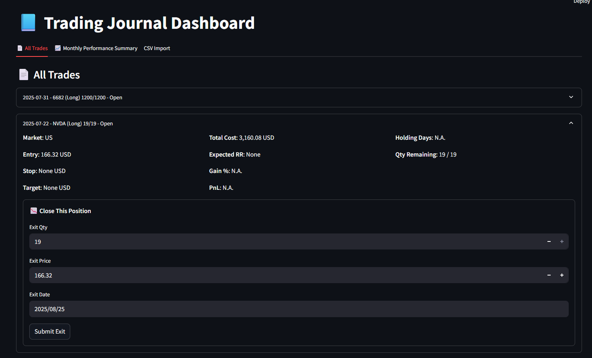
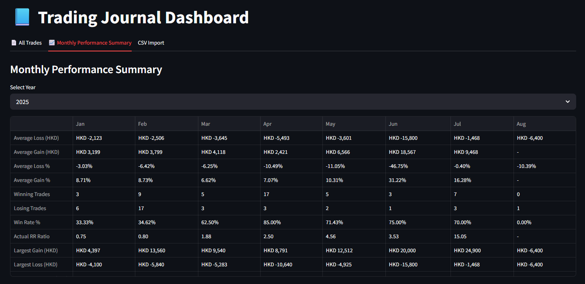
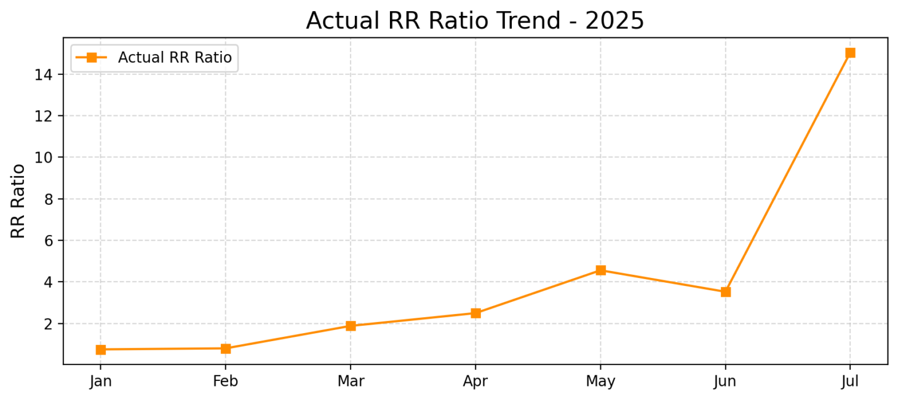
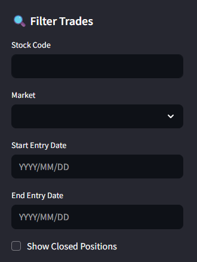

# 📈 My Trading App

A full-stack **Trading Journal** to record, manage, and analyze trades.  
Built with **FastAPI**, **SQLAlchemy (MySQL)**, and **Streamlit**.

---

## ✨ Features

- Record trade entries with stop-loss & target
- Manage **partial exits** (multiple exits per entry)
- Track **PnL, RR ratio, win rate, holding days**
- Monthly performance summary with styled tables & charts
- CSV import with validation
- REST API (FastAPI) + Interactive Dashboard (Streamlit)

---

## 🛠️ Tech Stack

- **Backend**: FastAPI, SQLAlchemy, Pydantic  
- **Frontend**: Streamlit, Matplotlib  
- **Database**: MySQL (with SQLite for testing)  
- **Utilities**: Pandas, python-dotenv  

---

## 📂 Project Structure

```
My-Trading-App/
├─ main.py              # FastAPI app (entries & exits API)
├─ streamlit_app.py     # Streamlit dashboard
├─ crud.py              # DB CRUD operations
├─ models.py            # SQLAlchemy models (TradeEntry, TradeExit)
├─ schemas.py           # Pydantic schemas for API I/O
├─ database.py          # DB session/engine config (.env based)
├─ utils.py             # Derived fields & monthly summary logic
├─ test_main.py         # FastAPI unit tests
├─ requirements.txt
├─ README.md
└─ screenshots/         # UI screenshots
```

---

## 🗄️ Database Schema

**TradeEntry** (`trade_entries`)  
- id (PK)  
- stock, market  
- position (Long/Short)  
- entry_date, entry_price  
- qty, remaining_qty  
- stop_loss_price, target_price  
- is_open (bool)

**TradeExit** (`trade_exits`)  
- id (PK)  
- entry_id (FK → trade_entries.id)  
- exit_date, exit_price, exit_qty  

> Each entry can have multiple exits → supports **partial closes**.

---

## ⚙️ Installation

1. Clone repo:
   ```bash
   git clone https://github.com/pakkei1212/My-Trading-App.git
   cd My-Trading-App
   ```

2. Create & activate virtual environment:
   ```bash
   python -m venv .venv
   source .venv/bin/activate   # Mac/Linux
   .venv\Scripts\activate      # Windows
   ```

3. Install dependencies:
   ```bash
   pip install -r requirements.txt
   ```

4. Configure `.env`:
   ```
   DB_HOST=localhost
   DB_PORT=3306
   DB_NAME=trading_journal
   DB_USER=myuser
   DB_PASSWORD=mypassword
   ```

5. Initialize MySQL schema:
   ```sql
   CREATE DATABASE trading_journal CHARACTER SET utf8mb4 COLLATE utf8mb4_unicode_ci;
   ```

---

## ▶️ Running

Start **FastAPI backend**:
```bash
uvicorn main:app --reload --port 8002
```

Start **Streamlit dashboard**:
```bash
streamlit run streamlit_app.py
```

Open:
- API Docs → [http://127.0.0.1:8002/docs](http://127.0.0.1:8002/docs)  
- Dashboard → [http://localhost:8501](http://localhost:8501)

---

## 📸 Screenshots

### 🔍 All Trades (with filters & inline exit form)


### 📊 Monthly Performance Summary


### 📈 Win Rate Trend


### 📈 RR Ratio Trend


### 🔍 Trade Filters

